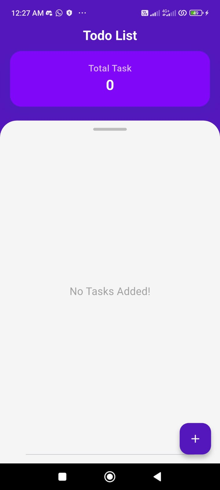
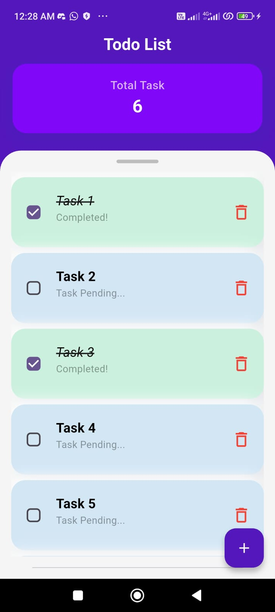
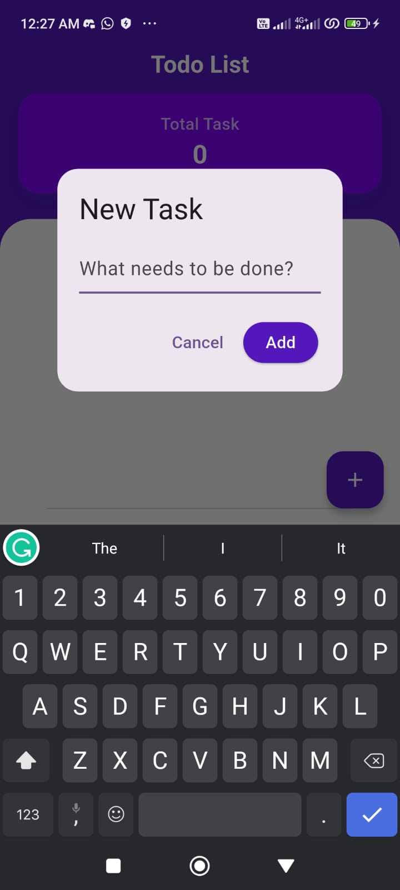

# 📝 Flutter Todo App

A clean and simple Todo application built using Flutter following MVVM architecture.

## 🚀 Features
- Add Task
- Delete Task
- Mark task as complete
- Persistent storage using Sqflite

## 🧠 Tech Stack
- Flutter
- Provider (State Management)
- Sqflite (Local Database)
- MVVM Architecture

## 📂 Folder Structure
lib/
- core/
- models/
- viewmodels/
- views/
- services/

## 📸 Screenshots

## 👨‍💻 Developer
Built by M Hamza Bashir
